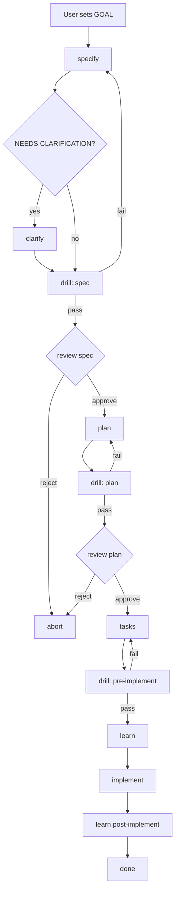

# Full SDD Cycle — Reference

Source workflow: `.specify/workflows/speckit/workflow.yml`

## Phase Diagram

## Skill Delegation Map

| Cycle phase | Skill file | Drill `$ARGUMENTS` |
|-------------|------------|----------------------|
| specify | `.claude/skills/speckit-specify/SKILL.md` | — |
| clarify (conditional) | `.claude/skills/speckit-clarify/SKILL.md` | — |
| drill (spec) | `.claude/skills/speckit-drill/SKILL.md` | `PHASE=spec` |
| plan | `.claude/skills/speckit-plan/SKILL.md` | — |
| drill (plan) | `.claude/skills/speckit-drill/SKILL.md` | `PHASE=plan` |
| tasks | `.claude/skills/speckit-tasks/SKILL.md` | — |
| drill (pre-implement) | `.claude/skills/speckit-drill/SKILL.md` | `PHASE=pre-implement` |
| learn | `.claude/skills/speckit-learn/SKILL.md` | — |
| implement | `.claude/skills/speckit-implement/SKILL.md` | — |
| analyze (inside pre-implement drill) | `.claude/skills/speckit-analyze/SKILL.md` | — |
| checklist (on demand) | `.claude/skills/speckit-checklist/SKILL.md` | — |

## Cycle State Fields

| Field | Written by | Purpose |
|-------|------------|---------|
| `current_phase` | cycle | Resume point |
| `phases_completed` | cycle | Audit trail of finished phases |
| `drill_results` | cycle (from drill output) | PASS/FAIL per drill phase |
| `learnings_recorded` | learn | Titles appended to KNOWLEDGE.md |
| `feature_directory` | specify | FEATURE_DIR for drills and child skills |

## Workflow.yml Mapping

| workflow.yml step | cycle phase |
|-------------------|-------------|
| `specify` | Phase 1 |
| `review-spec` gate | Phase 3 |
| `plan` | Phase 4 |
| `review-plan` gate | Phase 6 |
| `tasks` | Phase 7 |
| `implement` | Phase 10 |

Drills and learning extend the bundled workflow with constitution-aligned quality gates.

## Resume

Read `.specify/cycle-state.json` and continue from `current_phase`. If the user supplies a new GOAL, reset state and start at `specify`.
