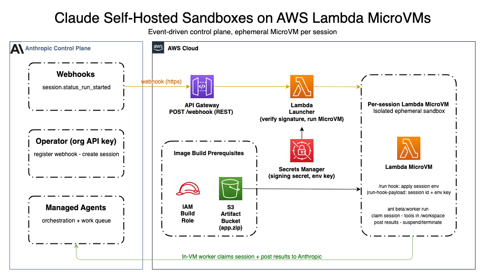

# Claude Self-Hosted Sandboxes on AWS Lambda MicroVMs

A reference solution that runs [Anthropic Claude self-hosted sandbox](https://platform.claude.com/docs/en/managed-agents/self-hosted-sandboxes)
tool execution inside [AWS Lambda MicroVMs](https://docs.aws.amazon.com/lambda/).
It implements the **orchestrator + ephemeral MicroVM per session** pattern: an
event-driven control plane in your AWS account launches a fresh, isolated MicroVM
for each Claude session, while orchestration stays on Anthropic's control plane.

This allows your agents to access resources through your AWS environment without
exposing connectivity, while you retain full monitoring and governance over those
resources.

> **Launcher status (this cycle):** the launcher is a Python **FastAPI + Mangum**
> app packaged as a Lambda **container image**, with the control plane defined in
> **CDK** (`utils/cdk/`). Automation is via a **Justfile** (`just run-local`,
> `just test`, `just cdk-synth`, `just docker-up`). See `CLAUDE.md` for the
> current repo layout and commands. The SAM `template.yaml` is retained only as a
> parity reference (superseded by CDK). The Node.js in-MicroVM worker
> (`src/microvm-image/`) is unchanged; porting it to Python is a separate
> follow-up.

## Quickstart (launcher)

```bash
just sync            # install deps (UV)
just run-local       # uvicorn on :8000 with the stub MicroVM client (no AWS)
just test            # pytest  (24 tests: launcher + CDK constructs)
just cdk-synth       # synthesize the control-plane template to utils/cdk/cdk.out
just docker-up       # DynamoDB Local + launcher (full local parity) on :8080
```

CDK tests need Node on PATH (jsii): see `utils/cdk/.tool-versions` and the
`cdk-test` recipe in `CLAUDE.md`.

This is a working reference intended for learning and adaptation.

## What is AWS Lambda MicroVMs?

AWS Lambda MicroVMs is a compute service that provides serverless, ephemeral
execution environments with strong VM-level isolation. Each MicroVM runs Amazon
Linux 2023 with full OS access for up to 8 hours and can be launched, suspended,
resumed, and terminated programmatically. It is purpose-built for running
user-supplied or AI-generated code in isolated sandboxes — this solution uses
one MicroVM per Claude session so sessions never share state.

Key differentiators:

- **Launch from snapshot** — MicroVMs boot from a pre-captured memory and disk
  snapshot, enabling rapid start times by skipping application initialization
  entirely.
- **4× vertical scaling without re-provisioning** — scale a running MicroVM's
  CPU and memory up to 4× its initial allocation without terminating or
  re-creating the compute environment.

## Architecture



The control plane is **event-driven** — there is no poller. The only inbound
traffic is the webhook call; the rest of the workflow is pull-based. The flow:

1. A Claude session reaches the running state and Anthropic sends a
   `session.status_run_started` **webhook** to an Amazon API Gateway endpoint.
2. API Gateway invokes the **launcher Lambda**. The launcher verifies the
   **webhook signature** in-process using the signing secret from Secrets Manager,
   denying invalid or stale deliveries.
3. The launcher calls `RunMicrovm` to launch one MicroVM for that session,
   passing the session dispatch via `runHookPayload`. It dedupes on the webhook
   event id (DynamoDB-backed) and stays within the RunMicrovm rate limit.
4. The MicroVM receives the dispatch on its `/run` hook: it fetches the
   environment key from Secrets Manager using its own execution role, claims
   the matching session from the Anthropic work queue, executes the agent's tool
   calls in `/workspace`, posts results back to Anthropic, and exits. The idle
   policy then suspends/terminates the VM.

**Credential boundaries.** The organization-scoped API key is used only by the
operator (registering the webhook, creating sessions) and never reaches AWS
compute. The environment key and the webhook signing secret live in AWS Secrets
Manager. The **launcher reads only the signing secret** (to verify the inbound
webhook) and never handles the environment key — it passes only a *reference* to
the environment-key secret into the MicroVM. The **MicroVM's execution role reads
only the environment key**. The organization API key is never placed on any AWS
compute.

## Prerequisites

- An AWS account with permissions for S3, IAM, Secrets Manager, API Gateway,
  Lambda, WAF, CloudWatch Logs, and AWS Lambda MicroVM.
- AWS CLI v2+ configured with the Lambda MicroVMs service model installed
  (`aws configure add-model`).
- The [AWS SAM CLI](https://docs.aws.amazon.com/serverless-application-model/latest/developerguide/install-sam-cli.html).
- An existing Claude [Managed Agents agent](https://platform.claude.com/docs/en/managed-agents/agent-setup)
  (note its agent ID) and a `self_hosted` environment (note its `env_...` id).
- A webhook signing secret and an environment key, both generated in the Claude Console.
- `zip` available locally (used to package the MicroVM image source).

## Project Structure

```
.
├── template.yaml                    # SAM template: launcher + REST API, WAF,
│                                    #   secrets, MicroVM execution role, image
│                                    #   build role + artifact bucket
├── src/
│   ├── microvm-image/               # Contents zipped into the MicroVM image
│   │   ├── Dockerfile               # AL2023 + Node worker, /workspace, /mnt/session/outputs
│   │   └── worker/worker.mjs        # HTTP lifecycle-hook server (EnvironmentWorker)
│   ├── functions/                   # Launcher Lambda (sam build packages this)
│   │   ├── launcher.py              # Verifies webhook signature; RunMicrovm per session
│   │   ├── requirements.txt         # Launcher deps (anthropic[webhooks], powertools, bundled boto3/botocore)
│   │   ├── shared/                  # Payload, rate limiter, MicroVM client, types
│   │   └── wheels/                  # Vendored boto3/botocore wheels (lambda-microvms client)
│   ├── scripts/
│   │   ├── build-image.sh           # Zip + upload + create-microvm-image
│   │   └── verify.py                # Operator-side: create a session to exercise the flow
├── docs/                            # Architecture diagram + notes
├── README.md  LICENSE  CONTRIBUTING.md  CODE_OF_CONDUCT.md
└── pyproject.toml  requirements.txt
```

`samconfig.toml` and `.aws-sam/` are generated locally by SAM and are git-ignored.

## Deployment

The deploy is **one IaC step plus three out-of-band steps**:

1. Deploy the control plane (SAM)
2. Register the webhook and populate secrets (Console + CLI)
3. Build the MicroVM image (CLI)
4. Verify end-to-end

### 1. Deploy the control plane (SAM)

```bash
sam build
sam deploy --guided --capabilities CAPABILITY_NAMED_IAM --parameter-overrides "AnthropicEnvironmentId=env_..."
```

`--guided` prompts for the stack name and region and writes your answers to
`samconfig.toml` (git-ignored), so subsequent deploys are just `sam build && sam
deploy`. The stack outputs include `WebhookUrl`, `ArtifactBucketName`,
`BuildRoleArn`, `EnvironmentKeySecretArn`, and `SigningSecretArn`.

### 2. Register the webhook and populate secrets (Console + CLI)

1. In the [Claude Console](https://platform.claude.com/settings/workspaces/default/webhooks),
   generate the **environment key** for your `self_hosted` environment.
2. Register the stack's `WebhookUrl` (from the deploy outputs) as a webhook
   endpoint subscribed to `session.status_run_started`. The Console will provide
   a **webhook signing secret** (`whsec_...`).
3. Store both in the secrets created by the stack:

```bash
aws secretsmanager put-secret-value --secret-id <EnvironmentKeySecretArn> --secret-string "<environment-key>"
aws secretsmanager put-secret-value --secret-id <SigningSecretArn>        --secret-string "<webhook-signing-secret>"
```

### 3. Build the MicroVM image (CLI)

```bash
./src/scripts/build-image.sh
```

The script zips `src/microvm-image/`, uploads to S3, and creates the image with
lifecycle hooks enabled. Monitor the build in CloudWatch under
`/aws/lambda/microvms/<image-name>`; the image transitions
`IN_PROGRESS → SUCCESSFUL`.

### 4. Verify (operator-side)

```bash
export ANTHROPIC_API_KEY="sk-ant-..."          # organization-scoped, operator only
export ANTHROPIC_ENVIRONMENT_ID="env_..."
export AGENT_ID="agent_..."
python src/scripts/verify.py --create
```

This creates a session, triggers the webhook, launches a MicroVM, and runs the
agent end-to-end. Confirm with `aws lambda-microvms list-microvms` /
`get-microvm`.

## Configuration

Launcher Lambda environment (set by the SAM template):

| Variable | Description |
| --- | --- |
| `ANTHROPIC_ENVIRONMENT_ID` | The self-hosted environment id. |
| `MICROVM_IMAGE_IDENTIFIER` | Name, ID, or ARN of the built MicroVM image. |
| `SIGNING_SECRET_ARN` | Secrets Manager ARN of the webhook signing secret (used to verify inbound webhooks). |
| `ENVIRONMENT_KEY_SECRET_ARN` | Secrets Manager ARN of the environment-key secret. Passed by *reference* into the MicroVM; the launcher does not read its value. |
| `MICROVM_EXECUTION_ROLE_ARN` | Execution role assigned to each MicroVM (used in-VM to read the environment key). |
| `ANTHROPIC_BASE_URL` (optional) | Override the default Claude API endpoint. |

The organization API key is **operator-only** and is never placed on any AWS
compute.

## Troubleshooting

| Symptom | Likely cause / fix |
| --- | --- |
| Webhook returns 401 | Signature verification failed in the launcher. Confirm the signing secret in Secrets Manager matches the Console, and that the delivery is fresh. |
| No MicroVM launches | Check the launcher logs; confirm the webhook is registered for `session.status_run_started` and the image identifier is correct. |
| Duplicate launches | Shouldn't occur — the launcher dedupes on webhook event id; retries reuse the id. |
| Image build fails `S3_*` | Build role/bucket issue. Confirm the artifact is in the same region, not in Glacier, and the Build role grants `s3:GetObject`. |
| Image build fails `ARCHIVE_DOCKERFILE_NOT_FOUND` | Dockerfile must be at the root of `app.zip`; `build-image.sh` zips from inside `microvm-image/`. |

## Cost

Costs are driven primarily by MicroVM run time (per AWS Lambda MicroVMs pricing),
plus standard API Gateway, Lambda, Secrets Manager, and S3 usage. Because each
session runs in its own MicroVM that is suspended/terminated at session end, cost
scales with concurrent sessions and their duration. Monitor with AWS Cost Explorer.

## Security

- The organization API key never reaches AWS compute or a MicroVM; only the
  per-session id and a *reference* to the environment-key secret are forwarded.
- The webhook is authenticated by signature verification in the launcher Lambda;
  invalid or stale deliveries are denied (401) before any MicroVM is launched.
- Secrets live in AWS Secrets Manager with least-privilege access (launcher →
  signing secret only; MicroVM execution role → environment key only).
- Each session runs in its own isolated MicroVM and is
  suspended/terminated at session end; the 8-hour maximum duration bounds any VM.
- The S3 artifact bucket blocks public access and enables versioning and
  server-side encryption.
- The public webhook endpoint sits behind an AWS WAF WebACL (AWS managed rule
  sets plus a per-IP rate limit) and API Gateway request validation, which reject
  malformed and abusive traffic before it reaches the launcher. These are
  defense-in-depth: the webhook signature check remains the authentication.

## License

This library is licensed under the MIT-0 License. See the [LICENSE](LICENSE) file.
